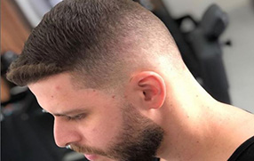

# 💈 Vieira Barbearia

Este é um projeto de site institucional para a **Vieira Barbearia**, desenvolvido em HTML, CSS e JavaScript. A página apresenta os serviços, produtos e formas de contato da barbearia, além de um carrossel interativo com imagens do estabelecimento.

## 📸 Visão Geral

 <!-- Substitua por uma imagem geral do site se quiser -->

O site é responsivo e oferece uma navegação simples e direta, focando na apresentação visual e na facilidade de agendamento.

## 🛠️ Tecnologias Utilizadas

- **HTML5** – Estrutura da página
- **CSS3** – Estilização (com `reset.css` e `styles.css`)
- **JavaScript (Swiper.js)** – Carrossel de imagens
- **Google Maps Embed** – Exibição do endereço

## 🔧 Funcionalidades

- Cabeçalho com logotipo e navegação
- Seção de apresentação com chamada para ação
- Carrossel de imagens com navegação automática
- Cards com informações sobre serviços, produtos e contato
- Mapa interativo com localização da barbearia
- Rodapé com direitos autorais

## 🚀 Como Executar Localmente

1. Clone este repositório:
   ```bash
   git clone https://github.com/seu-usuario/vieira-barbearia.git
